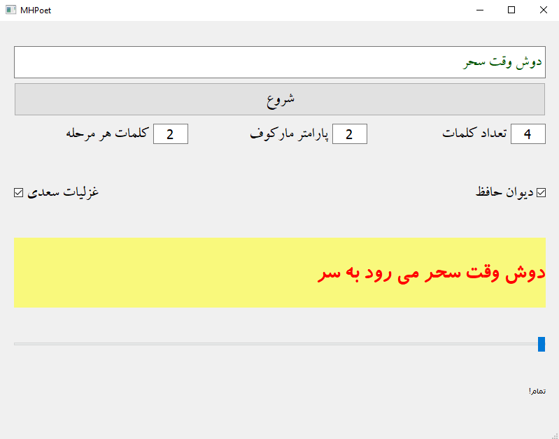
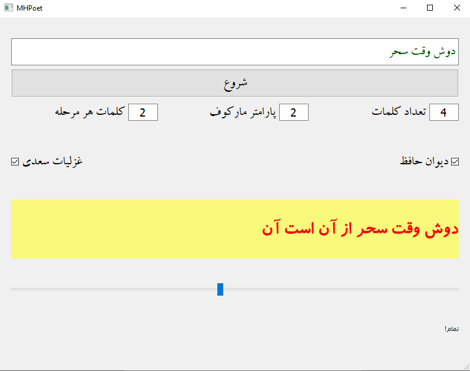
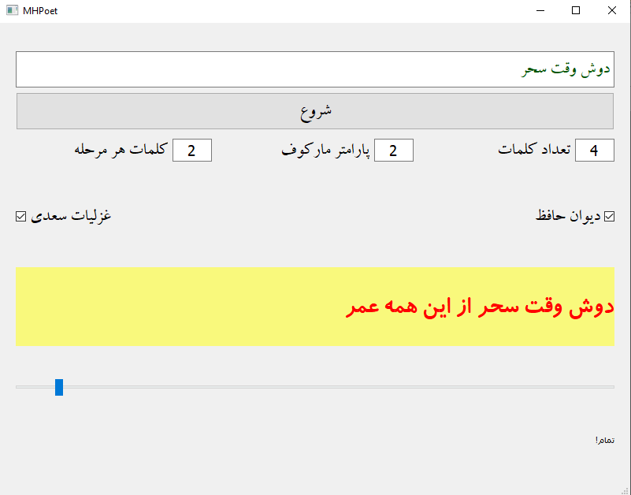

# MHPoet

This project is actually a **Probabilistic Language Model** trained on **Persian Literature**. It can generate poems based on two great persian poets, **Hafez** and **Saadi**.

I've implemented a simple gui for easy use too.

You can see some examples below.

#  Future Work
I wish I could add another great persian poet, **Molavi**, in the future. 

I've just spend about a night for this. So it may be full of bugs :) and it is not so fast. Having parallel processes may help to fasten it.

In the future I hope to do this by deep learning methods.
